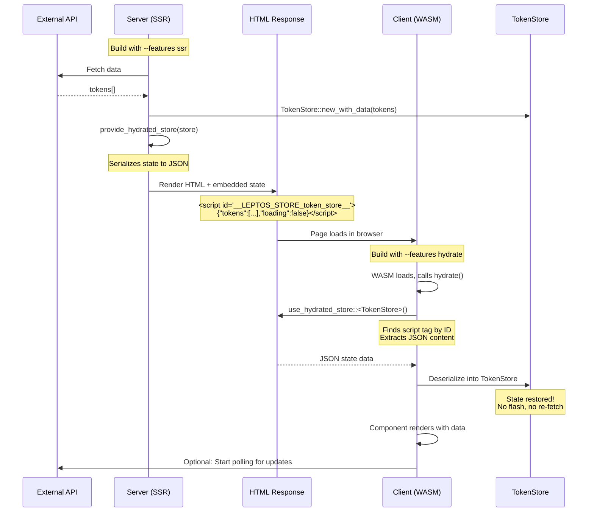
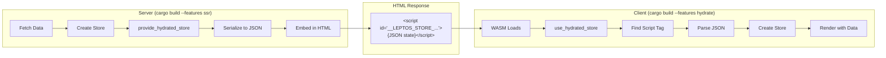
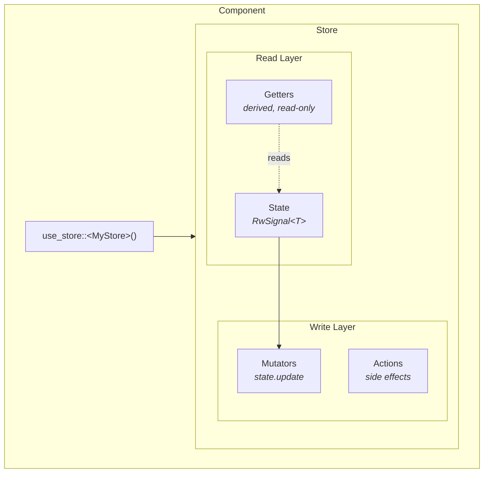
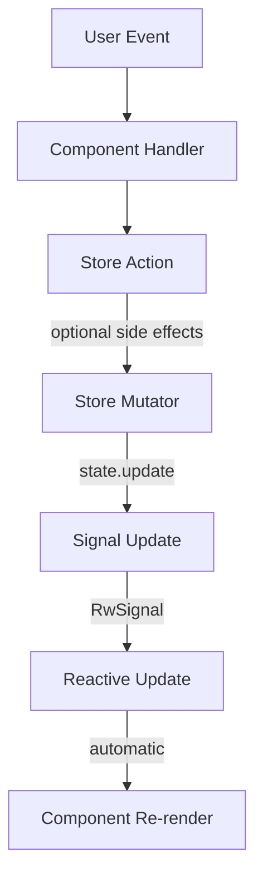
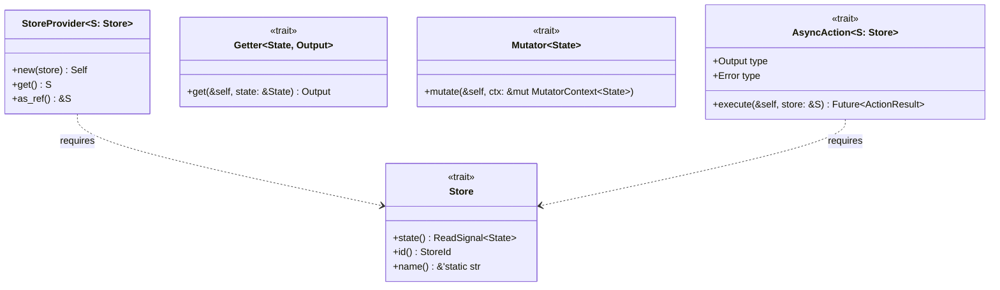

# Authoring Guide

> Complete guide for developing, contributing to, and maintaining leptos-store

This document provides comprehensive instructions for working with the leptos-store codebase, from initial setup through publishing releases.

---

## Table of Contents

- [Prerequisites](#prerequisites)
- [Getting Started](#getting-started)
- [Project Structure](#project-structure)
- [Development Workflow](#development-workflow)
- [Creating Stores](#creating-stores)
- [Testing](#testing)
- [Code Quality](#code-quality)
- [Documentation](#documentation)
- [Running the Example](#running-the-example)
- [Publishing](#publishing)
- [Architecture Reference](#architecture-reference)
- [Troubleshooting](#troubleshooting)

---

## Prerequisites

### Required Tools

| Tool | Minimum Version | Installation |
|------|-----------------|--------------|
| Rust | 1.85+ | [rustup.rs](https://rustup.rs) |
| Cargo | (bundled) | Comes with Rust |
| Make | 3.81+ | Usually pre-installed |

### Optional Tools

| Tool | Purpose | Installation |
|------|---------|--------------|
| cargo-leptos | SSR build tool for examples | `cargo install cargo-leptos` |
| trunk | WASM bundler for CSR examples | `cargo install trunk` |
| cargo-watch | Auto-rebuild on changes | `cargo install cargo-watch` |
| cargo-tarpaulin | Code coverage | `cargo install cargo-tarpaulin` |
| cargo-audit | Security audits | `cargo install cargo-audit` |
| cargo-outdated | Dependency updates | `cargo install cargo-outdated` |

### WASM Target (for examples)

```bash
rustup target add wasm32-unknown-unknown
```

---

## Getting Started

### Clone and Setup

```bash
# Clone the repository
git clone https://github.com/your-org/leptos-store.git
cd leptos-store

# Verify setup
make check

# Run tests
make test
```

### Quick Commands Reference

```bash
make help                              # Show all available commands
make check                             # Verify compilation
make test                              # Run all tests
make clippy                            # Run lints
make fmt                               # Format code
make examples-list                     # List all examples
make run NAME=token-explorer-example   # Run SSR example
make example                           # Run auth example (legacy)
make doc-open                          # View documentation
```

---

## Project Structure

```
leptos-store/
├── Cargo.toml                 # Workspace configuration
├── Makefile                   # Build automation
├── README.md                  # User-facing documentation
├── AUTHORING.md               # This file
│
├── src/                       # Library source code
│   ├── lib.rs                 # Crate entry point, module docs
│   ├── prelude.rs             # Re-exports for users
│   ├── store.rs               # Core Store trait, builders
│   ├── context.rs             # Leptos context integration
│   ├── async.rs               # Async action support
│   ├── hydration.rs           # SSR hydration support (feature: hydrate)
│   └── macros.rs              # Declarative macros
│
├── examples/
│   ├── auth-store-example/    # Basic auth example
│   │   ├── Cargo.toml
│   │   ├── index.html
│   │   └── src/
│   │       ├── lib.rs
│   │       ├── auth_store.rs
│   │       └── components.rs
│   │
│   └── token-explorer-example/ # Full SSR hydration example
│       ├── Cargo.toml
│       ├── style/main.css
│       └── src/
│           ├── main.rs         # SSR server entry point
│           ├── lib.rs          # Hydration entry point
│           ├── token_store.rs  # HydratableStore implementation
│           └── components.rs   # Leptos components
│
├── scripts/                   # Build and release scripts
│   ├── bump-version.sh
│   ├── release.sh
│   └── publish.sh
│
└── docs/
    └── specs/
        └── leptos-storekit-spec.md  # Original specification
```

### Module Responsibilities

| Module | Responsibility |
|--------|---------------|
| `store.rs` | Core `Store` trait, `Getter`, `Mutator`, `StoreBuilder`, `StoreRegistry` |
| `context.rs` | `provide_store`, `use_store`, `StoreProvider`, scoped stores, hydration context functions |
| `async.rs` | `Action`, `AsyncAction`, `ReactiveAction`, `ActionState` |
| `hydration.rs` | `HydratableStore` trait, serialization/deserialization, `HydrationBuilder` (feature: `hydrate`) |
| `macros.rs` | `store!`, `define_state!`, `define_hydratable_state!`, `define_action!`, `define_async_action!`, `impl_store!`, `impl_hydratable_store!` |
| `prelude.rs` | Public API re-exports |

---

## Development Workflow

### Standard Development Cycle

```bash
# 1. Make changes to source files

# 2. Check compilation
make check

# 3. Run tests
make test

# 4. Check lints
make clippy

# 5. Format code
make fmt

# 6. Commit changes
git add -A && git commit -m "feat: your feature"
```

### Watch Mode (Auto-rebuild)

```bash
# Watch and run tests on changes
make watch

# Watch and run clippy on changes
make watch-clippy
```

### Feature Flags

The crate supports these feature flags:

| Flag | Description | Default | Dependencies |
|------|-------------|---------|--------------|
| `ssr` | Server-side rendering support | ✅ Yes | None |
| `hydrate` | SSR hydration with state serialization | ❌ No | `serde`, `serde_json`, `web-sys`, `wasm-bindgen` |
| `csr` | Client-side rendering only | ❌ No | None |

#### Why is `hydrate` opt-in?

The `hydrate` feature adds serialization capabilities for transferring state from server to client. It's opt-in because:

1. **Added dependencies**: Brings in `serde`, `serde_json`, and WASM bindings (~50KB to WASM)
2. **Type requirements**: State types must derive `Serialize` and `Deserialize`
3. **Not always needed**: CSR apps and simple SSR apps don't need state transfer

#### When to use each feature

| Your App Type | Server Features | Client Features |
|---------------|-----------------|-----------------|
| **CSR only** (SPA) | N/A | `csr` |
| **SSR without hydration** | `ssr` | N/A |
| **Full SSR with hydration** | `ssr` | `hydrate` |

#### Testing all feature combinations

```bash
make check-features
```

This runs:
```bash
cargo check --no-default-features
cargo check --features ssr
cargo check --features hydrate
cargo check --features csr
```

See [Understanding SSR Hydration](#understanding-ssr-hydration) for detailed architecture documentation.

---

## Creating Stores

The library enforces the **Enterprise Mode** pattern:

- **Getters**: Public, read-only derived values
- **Mutators**: **Private**, internal state modification only
- **Actions**: **Public**, the only external API for writes

This ensures external code cannot bypass business logic by calling mutators directly.

### Manual Store Definition

```rust
use leptos::prelude::*;
use leptos_store::prelude::*;

// 1. Define your state
#[derive(Clone, Debug, Default)]
pub struct CounterState {
    pub count: i32,
    pub name: String,
}

// 2. Define your store
#[derive(Clone)]
pub struct CounterStore {
    state: RwSignal<CounterState>,  // Private field
}

impl CounterStore {
    pub fn new() -> Self {
        Self {
            state: RwSignal::new(CounterState::default()),
        }
    }

    // Getters - PUBLIC, derived read-only values
    pub fn doubled(&self) -> i32 {
        self.state.with(|s| s.count * 2)
    }

    // Mutators - PRIVATE, internal state changes only
    fn set_count(&self, value: i32) {
        self.state.update(|s| s.count = value);
    }

    fn set_name(&self, name: String) {
        self.state.update(|s| s.name = name);
    }

    // Actions - PUBLIC, the external API for writes
    pub fn increment(&self) {
        let current = self.state.with(|s| s.count);
        self.set_count(current + 1);
    }

    pub fn rename(&self, name: String) {
        self.set_name(name);
    }

    pub fn reset(&self) {
        self.set_count(0);
        self.set_name(String::new());
    }
}

// 3. Implement the Store trait
impl Store for CounterStore {
    type State = CounterState;

    fn state(&self) -> ReadSignal<Self::State> {
        self.state.read_only()
    }
}
```

### Using the `store!` Macro

```rust
use leptos_store::store;

store! {
    pub CounterStore {
        state CounterState {
            count: i32 = 0,
            name: String = "Counter".to_string(),
        }

        getters {
            doubled(this) -> i32 {
                this.read(|s| s.count * 2)
            }
        }

        // PRIVATE - internal state changes only
        mutators {
            set_count(this, value: i32) {
                this.mutate(|s| s.count = value);
            }
            set_name(this, name: String) {
                this.mutate(|s| s.name = name);
            }
        }

        // PUBLIC - the external API for writes
        actions {
            increment(this) {
                let current = this.read(|s| s.count);
                this.set_count(current + 1);
            }
            rename(this, name: String) {
                this.set_name(name);
            }
            reset(this) {
                this.set_count(0);
                this.set_name(String::new());
            }
        }
    }
}
```

### Using in Components

```rust
use leptos::prelude::*;
use leptos_store::prelude::*;

#[component]
pub fn App() -> impl IntoView {
    // Provide store to component tree
    provide_store(CounterStore::new());

    view! {
        <Counter />
    }
}

#[component]
fn Counter() -> impl IntoView {
    let store = use_store::<CounterStore>();

    view! {
        <div>
            <p>"Count: " {move || store.state().get().count}</p>
            <p>"Doubled: " {move || store.doubled()}</p>
            <button on:click=move |_| store.increment()>"+"</button>
        </div>
    }
}
```

### Mutation Rules

| Layer | Can Write State | Async | Side Effects |
|-------|-----------------|-------|--------------|
| Components | ❌ | ❌ | ❌ |
| Getters | ❌ | ❌ | ❌ |
| Mutators | ✅ | ❌ | ❌ |
| Actions | ❌ | ❌ | ✅ |
| Async Actions | ❌ | ✅ | ✅ |

**Key principle: Only mutators may write state.**

---

## Understanding SSR Hydration

### What is Hydration?

In a full SSR (Server-Side Rendering) application, the server renders the initial HTML with data already populated. When the client (browser) loads this HTML, it needs to "hydrate" - meaning it attaches JavaScript interactivity to the existing HTML without re-rendering everything.

**The Problem**: The server fetches data and renders HTML, but when the client JavaScript loads, it doesn't have that data. Without hydration, the client would need to re-fetch everything, causing:
- Flash of empty content
- Duplicate API calls
- Poor user experience

**The Solution**: Serialize the server-side state into the HTML, then deserialize it on the client.

### How leptos-store Hydration Works



**The flow in detail:**



### Feature Flag Architecture

The `hydrate` feature is **opt-in** because it adds dependencies and complexity only needed for SSR hydration:

| Feature | Dependencies Added | Use Case |
|---------|-------------------|----------|
| `ssr` (default) | None | Server-side rendering without state transfer |
| `hydrate` | `serde`, `serde_json`, `web-sys`, `wasm-bindgen` | Full SSR with client hydration |
| `csr` | None | Client-side only apps (SPAs) |

**Why opt-in?**
- Adds ~50KB to WASM bundle (serde)
- Requires state types to derive `Serialize`/`Deserialize`
- Not needed for CSR-only or simple SSR apps

### Cargo.toml Setup for SSR + Hydration

```toml
[package]
name = "my-app"

[lib]
crate-type = ["cdylib", "rlib"]

[dependencies]
leptos = { version = "0.8", default-features = false }
leptos-store = { version = "0.1", default-features = false }
serde = { version = "1.0", features = ["derive"] }

[features]
default = []
# Server build - runs on the server, renders HTML
ssr = ["leptos/ssr", "leptos-store/ssr"]
# Client build - compiles to WASM, hydrates in browser
hydrate = ["leptos/hydrate", "leptos-store/hydrate"]
```

Build commands:
```bash
# Server binary (includes SSR rendering)
cargo build --features ssr

# Client WASM (hydrates in browser)
cargo build --lib --target wasm32-unknown-unknown --features hydrate
```

Or use `cargo-leptos` which handles this automatically.

---

## Creating Hydratable Stores (SSR)

For SSR applications, stores need to transfer state from server to client. Implement the `HydratableStore` trait:

### Manual Implementation

```rust
use leptos::prelude::*;
use leptos_store::prelude::*;
use serde::{Serialize, Deserialize};

// 1. State must be serializable
#[derive(Clone, Debug, Default, Serialize, Deserialize)]
pub struct TokenState {
    pub tokens: Vec<Token>,
    pub error: Option<String>,
}

// 2. Define store as usual
#[derive(Clone)]
pub struct TokenStore {
    state: RwSignal<TokenState>,
}

impl Store for TokenStore {
    type State = TokenState;
    fn state(&self) -> ReadSignal<Self::State> {
        self.state.read_only()
    }
}

// 3. Implement HydratableStore (feature: hydrate)
#[cfg(feature = "hydrate")]
impl HydratableStore for TokenStore {
    fn serialize_state(&self) -> Result<String, StoreHydrationError> {
        serde_json::to_string(&self.state.get())
            .map_err(|e| StoreHydrationError::Serialization(e.to_string()))
    }

    fn from_hydrated_state(data: &str) -> Result<Self, StoreHydrationError> {
        let state: TokenState = serde_json::from_str(data)
            .map_err(|e| StoreHydrationError::Deserialization(e.to_string()))?;
        Ok(Self { state: RwSignal::new(state) })
    }

    fn store_key() -> &'static str {
        "token_store"  // Unique key for this store
    }
}
```

### Using Macros

```rust
use leptos_store::{define_hydratable_state, impl_hydratable_store};

// Define state with serde derives
define_hydratable_state! {
    pub struct TokenState {
        tokens: Vec<Token>,
        error: Option<String>,
    }
}

// Implement HydratableStore
impl_hydratable_store!(TokenStore, TokenState, state, "token_store");
```

### SSR Integration

**Server-side (`main.rs` with `ssr` feature):**

```rust
// Create and populate store
let store = TokenStore::new_with_data(tokens);

// Provide to context and get hydration script
let hydration_script = provide_hydrated_store(store);

view! {
    <!DOCTYPE html>
    <html>
        <head>
            <HydrationScripts/>
        </head>
        <body>
            {hydration_script}  // Renders <script> with JSON state
            <App/>
        </body>
    </html>
}
```

**Client-side (`lib.rs` with `hydrate` feature):**

```rust
#[wasm_bindgen]
pub fn hydrate() {
    leptos::mount::hydrate_body(App);
}

#[component]
fn App() -> impl IntoView {
    // Automatically reads state from DOM and creates store
    let store = use_hydrated_store::<TokenStore>();
    
    view! { /* ... */ }
}
```

---

## Testing

### Running Tests

```bash
# All tests
make test

# Verbose output
make test-verbose

# Library tests only
make test-lib

# Example tests only
make test-example

# With coverage
make coverage
```

### Writing Tests

Tests should be placed in a `#[cfg(test)]` module at the bottom of each file:

```rust
#[cfg(test)]
mod tests {
    use super::*;

    #[test]
    fn test_store_creation() {
        let store = MyStore::new();
        assert_eq!(store.state().get().field, expected_value);
    }

    #[test]
    fn test_mutator() {
        let store = MyStore::new();
        store.set_field("new value".to_string());
        assert_eq!(store.state().get().field, "new value");
    }
}
```

### Test Organization

| Test Type | Location | Command |
|-----------|----------|---------|
| Unit tests | `src/*.rs` | `make test-lib` |
| Doc tests | Doc comments | `make test-doc` |
| Integration tests | `tests/*.rs` | `make test` |
| Example tests | `examples/*/src/*.rs` | `make test-example` |

---

## Code Quality

### Linting

```bash
# Run clippy
make clippy

# Auto-fix issues
make clippy-fix
```

### Formatting

```bash
# Format code
make fmt

# Check formatting (CI)
make fmt-check
```

### Full CI Pipeline

```bash
make ci  # Runs: fmt-check → clippy → test-all
```

### Code Style Guidelines

1. **Documentation**: All public items must have doc comments
2. **Error handling**: Use `thiserror` for custom errors
3. **Traits**: Prefer trait bounds over concrete types
4. **Naming**: Follow Rust conventions (snake_case, PascalCase)
5. **Imports**: Group by std → external → crate

---

## Documentation

### Building Docs

```bash
# Build documentation
make doc

# Build and open in browser
make doc-open

# Include private items
make doc-private
```

### Writing Documentation

Use rustdoc conventions:

```rust
/// Brief description of the item.
///
/// Longer description with more details about behavior,
/// edge cases, and usage patterns.
///
/// # Arguments
///
/// * `param` - Description of the parameter
///
/// # Returns
///
/// Description of what is returned.
///
/// # Panics
///
/// Conditions under which this function panics.
///
/// # Examples
///
/// ```rust,ignore
/// let result = my_function(arg);
/// assert_eq!(result, expected);
/// ```
pub fn my_function(param: Type) -> ReturnType {
    // ...
}
```

---

## Running Examples

### Listing Available Examples

```bash
make examples-list
```

This shows all examples with their descriptions and ports.

### Running an Example

```bash
# Run any example by name (SSR mode with cargo-leptos)
make run NAME=auth-store-example
make run NAME=token-explorer-example

# Legacy command for auth-store-example
make example
```

### Building Examples

```bash
# Build specific example
make build-example NAME=token-explorer-example

# Build in release mode
make build-example-release NAME=token-explorer-example

# Check example compiles (both SSR and hydrate)
make check-example NAME=token-explorer-example

# Test all examples
make test-all-examples

# Check all examples compile
make check-all-examples
```

### Example Ports

| Example | Port | URL |
|---------|------|-----|
| auth-store-example | 3000 | http://127.0.0.1:3000 |
| token-explorer-example | 3005 | http://127.0.0.1:3005 |

---

## Example: auth-store-example

Basic authentication flow demonstrating core leptos-store patterns.

### Features

- ✅ Store definition with state, getters, mutators
- ✅ Context-based store sharing
- ✅ Login form with validation
- ✅ Reactive UI updates
- ✅ Error handling
- ✅ Loading states

### Running

```bash
make run NAME=auth-store-example
# or legacy: make example
```

---

## Example: token-explorer-example

**Full SSR with hydration** - Real-time Solana token explorer using Jupiter API.

### Features

- ✅ Full SSR with `cargo-leptos`
- ✅ `HydratableStore` implementation for state transfer
- ✅ Server-side data fetching from Jupiter API
- ✅ Automatic state hydration on client
- ✅ Client-side polling (30s refresh)
- ✅ Reactive filtering and sorting
- ✅ URL-synced query parameters
- ✅ Beautiful token card UI

### Architecture

```
Server (SSR)                    Client (Hydration)
┌─────────────────┐            ┌─────────────────┐
│ Fetch tokens    │            │ Read hydration  │
│ from Jupiter    │──render──▶ │ data from DOM   │
│                 │            │                 │
│ Serialize state │            │ Deserialize     │
│ to <script> tag │            │ into TokenStore │
└─────────────────┘            └─────────────────┘
                                      │
                                      ▼
                               ┌─────────────────┐
                               │ Start polling   │
                               │ for updates     │
                               └─────────────────┘
```

### Running

```bash
make run NAME=token-explorer-example
# Opens at http://127.0.0.1:3005
```

### Key Files

| File | Purpose |
|------|---------|
| `src/main.rs` | SSR server with Actix-web, renders hydration script |
| `src/lib.rs` | WASM hydration entry point |
| `src/token_store.rs` | `TokenStore` with `HydratableStore` implementation |
| `src/components.rs` | UI components with reactive filtering |

---

## Publishing

### Pre-release Checklist

- [ ] All tests pass: `make test-all`
- [ ] No clippy warnings: `make clippy`
- [ ] Code formatted: `make fmt-check`
- [ ] Documentation builds: `make doc`
- [ ] Version bumped in `Cargo.toml`
- [ ] CHANGELOG updated
- [ ] All changes committed

### Version Bumping

Edit `Cargo.toml`:

```toml
[package]
version = "0.2.0"  # Update this
```

### Publishing Steps

```bash
# 1. Verify everything works
make ci

# 2. Dry run (no actual publish)
make publish-dry

# 3. Create git tag
make tag

# 4. Publish to crates.io
make publish

# 5. Push tags
make tag-push
```

### Versioning Guidelines

Follow [Semantic Versioning](https://semver.org/):

- **MAJOR** (1.0.0): Breaking API changes
- **MINOR** (0.1.0): New features, backward compatible
- **PATCH** (0.0.1): Bug fixes, backward compatible

---

## Architecture Reference

### Core Abstractions



### Data Flow



### Type Hierarchy



---

## Troubleshooting

### Common Issues

#### "Store not found in context"

**Cause**: `use_store` called before `provide_store`.

**Fix**: Ensure `provide_store` is called in a parent component:

```rust
#[component]
fn App() -> impl IntoView {
    provide_store(MyStore::new());  // Must be before children
    view! { <Child /> }
}
```

#### "cannot be sent between threads safely"

**Cause**: State type doesn't implement `Send + Sync`.

**Fix**: Ensure your state derives or implements the required traits:

```rust
#[derive(Clone, Debug, Default)]
pub struct MyState {
    // All fields must be Send + Sync
}
```

#### Trunk build fails

**Cause**: Missing WASM target.

**Fix**:

```bash
rustup target add wasm32-unknown-unknown
```

#### Clippy warnings about `Clone` on signals

**Cause**: Leptos signals are `Copy`, not just `Clone`.

**Fix**: Remove unnecessary `.clone()` calls on signals.

#### Hydration mismatch errors

**Cause**: Server and client rendered different HTML.

**Fix**: Ensure the store state is identical on both sides:

```rust
// Server: Serialize and embed state
let hydration_script = provide_hydrated_store(store);

// Client: Read from DOM, not create new
let store = use_hydrated_store::<MyStore>();  // NOT MyStore::new()
```

#### "Hydration data not found" error

**Cause**: The hydration `<script>` tag is missing from the HTML.

**Fix**: Ensure the server renders the hydration script:

```rust
view! {
    {provide_hydrated_store(store)}  // Must be in the view
    <App/>
}
```

#### State not serializing correctly

**Cause**: State type doesn't derive `Serialize` and `Deserialize`.

**Fix**: Add serde derives to your state:

```rust
#[derive(Clone, Debug, Default, Serialize, Deserialize)]
pub struct MyState {
    // fields...
}
```

### Getting Help

1. Check the [README](./README.md) for basic usage
2. Read the [specification](./docs/specs/leptos-storekit-spec.md)
3. Run `make doc-open` to browse API documentation
4. Open an issue on GitHub

---

## Quick Reference Card

```bash
# Development
make check           # Check compilation
make test            # Run tests
make clippy          # Run lints
make fmt             # Format code
make ci              # Full CI pipeline

# Examples (generic)
make examples-list                        # List all examples
make run NAME=token-explorer-example      # Run specific example
make build-example NAME=auth-store-example # Build specific example
make check-all-examples                   # Check all examples compile
make test-all-examples                    # Test all examples

# Examples (legacy auth-store-example)
make example         # Run auth example
make example-release # Build optimized

# Documentation
make doc-open        # View docs in browser

# Publishing
make publish-dry     # Test publish
make publish         # Publish to crates.io

# Version Management
make version         # Show current version
make bump            # Auto-bump based on commits
make release         # Full release process

# Utilities
make clean           # Clean artifacts
make help            # Show all commands
make loc             # Lines of code stats
```

---

*Last updated: January 2026*
